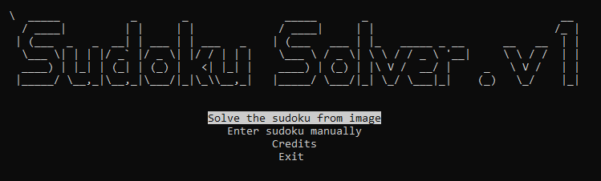

# Sudoku Solver

This repository contains a Python program for solving Sudoku puzzles using graph coloring and backtracking. The solver utilizes NetworkX for graph representation, OpenCV for board image processing. Additionally, it provides a user-friendly interface with curses for manual puzzle entry and interaction.



## Features

- Automatically solve Sudoku puzzles using backtracking and graph coloring.
- Solve Sudoku puzzles from board image. (WILL BE ADDED SOON)
- Automate the process of solving puzzles on sudoku.com.

## Instructions
- Use the arrow keys to navigate the menu options.
- Press "Enter" to select an option.
- If you choose to solve a Sudoku puzzle manually:
    - Use the arrow keys to move the cursor.
    - Press a number key (1-9) to input a number in the selected cell.
    - Press "R" to reset the puzzle.
    - Press "S" to solve the puzzle.
    - Press "A" to automate solving on sudoku.com

## Prerequisites

Before using the Sudoku Solver, ensure you have the following libraries installed:

- NumPy
- NetworkX
- Matplotlib
- PyAutoGUI
- OpenCV
- Curses

You can install these libraries using the following command:
```
pip install numpy networkx matplotlib pyautogui opencv-python-headless curses
```

### Usage

1. Clone this repository to your local machine using:
```
git clone git@github.com:PeWeX47/Sudoku-Solver.git
```

2. Navigate to the repository directory:
```
cd sudoku-solver
```

3. Run the Sudoku Solver using the following command in command prompt:
```
python app.py
```

### Credits
This Sudoku Solver was created as a project for Discrete Optimization course at my university. Feel free to contribute to the project by adding more features or improving the existing code.
